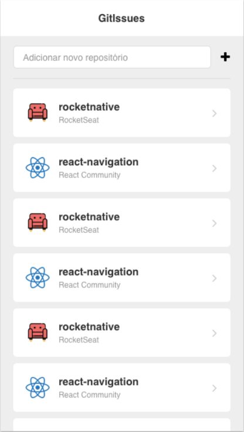
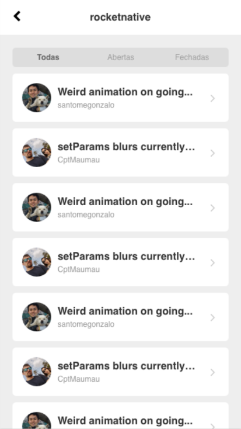

# GitIssues

<p align="center">
    <a href="https://github.com/yagoernandes">
        
    </a>
    <a href="#">
        
    </a>
    <a href="https://github.com/yagoernandes/gitissues/stargazers">
        
    </a>
    <br />
    <a href="https://twitter.com/intent/follow?screen_name=yagoernandes">
        </a>
</p>

> Aplicativo desenvolvido em react-native para acompanhar as issues de repositórios github

<p align="center">
    
    
</p>

##  Utilização

Para instalar as depencências:

```sh
npm install
```

Para rodar no expo

```sh
expo start
```

Adicione um repositório digitando:

```
{organização}/{repositório}
```

## Observações

Dependências utilizadas:

- expo: Abstração do react-native
- axios: Requisições a api do Github
- react-navigation: Roteamento de páginas

Ferramentas utilizadas:

- Editor Vscode com a extensão Prettier para formatar o código seguindo a style guide padrão
